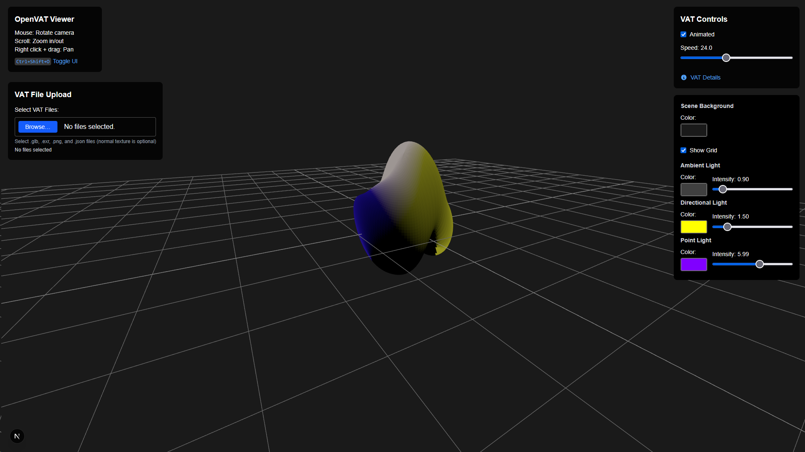

# OpenVAT three.js / WebGL Viewer

An early proof-of-concept WebGL viewer based on [three.js](https://threejs.org/) for viewing
Vertext Animation Textures exported from [OpenVAT](https://openvat.org/).



## Stack
* three.js
* React Fiber
* Next.js
* Turbopack
* Tailwind CSS

## Building

Make sure [npm](https://www.npmjs.com/) is installed.

From a terminal, set this repository as the current directory and then run:

```shell
npm install
```

```shell
npm run dev
```

Browse to [http://localhost:3000](http://localhost:3000)

## OpenVAT Export Settings Example


> [!IMPORTANT]
> There is currently an issue with the glTF exporter. In order to get your 
> model working you will need to select the VAT preview object that is created
> in the Blender scene after VAT encoding finishes and re-export it as glTF
> manually. In the export dialog, you may want to turn on **Include > Limit to > Selected Objects**,
> turn off **Data > Shape Keys** and **Data > Skinning**, and turn off all **Animation** export.

## Limitations

> [!NOTE]
> Currently, models have to be exported with these settings in OpenVAT:

* Separate position and normal textures
* glTF only (FBX forces trianglution on import in three.js which messes up the vertex count)
* OpenVAT glTF export currently strips materials during export from Blender, but you can manaully re-add and re-export
* The viewer supports selecting and loading the separate normals texture, but it is not currently used by the fragment shader